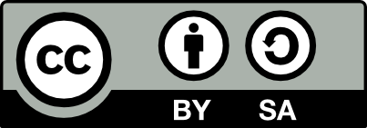

> From closed research to research you can trust

[Click here to see the materials in full screen](credible-research-slides.qmd)

```{=html}
<iframe class="slide-deck" src="credible-research-slides.html" height="420" width="747" style="border: 1px solid #2e3846;"></iframe>
```

## About these materials

::: {.callout-warning collapse="true"}
## Citation statement
Please cite these materials as: Von Grebmer zu Wolfsthurn, S., & Ihle, M. (2026). *Credible research* [Quarto slides]. [LMU Open Science Center](https://www.osc.lmu.de/). [https://lmu-osc.github.io/teaching-material-for-novices/open-research-principles/credible-research](https://lmu-osc.github.io/teaching-material-for-novices/open-research-principles/credible-research)
:::

**Welcome!** This workshop is intended to provide learners with an **introduction to open research**, its core **values**, **principles** and **key open open research practices** with the ultimate goal to boost replicability of research outputs. More specifically, it explores how replicability can be increased by fostering reliability on the one hand, and reproducibility on the other hand. Through *a priori* study planning and tools such as **preregistration**, **registered reports** and **data simulation methods**, researchers can reduce their own biases and produce more reliable studies. Through data sharing and increasing **computational reproducibility**, for example through RStudio projects, living Quarto documents and meticulous documentation of code and all research steps involved, researchers can ultimately produce more **credible and transparent research**. 

### Who are these materials for?

- **Educators** in higher education with or without familiarity with open research planning to **teach open research novices**
- **Self-learners** with no or limited familiarity with open research planning to **develop and build** up on their open research skills

## Prerequisites

<div style="font-size: 0.8em;">
| Prerequisite   |  Description  | Link/Where to find it   |
|------------|------------|------------|
| UNESCO Recommendations on Open Science | For a first overview of Open Research, particularly pp 6-19 | [Download here](https://unesdoc.unesco.org/ark:/48223/pf0000379949) |
| Introduction to reproducibility and replicability | Basic familiarity with current challenges in research and the effects on research quality | [https://lmu-osc.github.io/teaching-material-for-novices/open-research-principles/reproducibility-replicability](https://lmu-osc.github.io/teaching-material-for-novices/open-research-principles/reproducibility-replicability) |
</div>


## Learning goals - ADD

- *Unfinished section - work in progress*


### Export slides

You can export these slides as MS PowerPoint (.pptx - *in progress*) or pdf by clicking below. Note that basic formatting will be applied to the PowerPoint file.

<!-- download as pdf button -->
<a href="credible-research-slides.pdf"
   download="credible-research-slides.pdf"
   class="btn btn-primary">
  Download slides as PDF
</a>
 
## Contributors and licence details

**Creators**: Von Grebmer zu Wolfsthurn, Sarah ({fig-alt="orcid logo"}
[0000-0002-6413-3895](https://orcid.org/0000-0002-6413-3895)), Ihle, Malika ({fig-alt="orcid logo"} [0000-0002-3242-5981](https://orcid.org/0000-0002-3242-5981))

<br>

<p style="text-align:center;">
  
</p>

<div style="background-color: #f0f0f0; padding: 0.05em; border-radius: 2px; font-size: 0.6em;">
This current work by Sarah von Grebmer zu Wolfsthurn, and Malika Ihle is licensed under a [Creative Commons Attribution 4.0 International SA License](https://creativecommons.org/licenses/by-sa/4.0/deed.en) (CC-BY-SA 4.0). 
</div>
